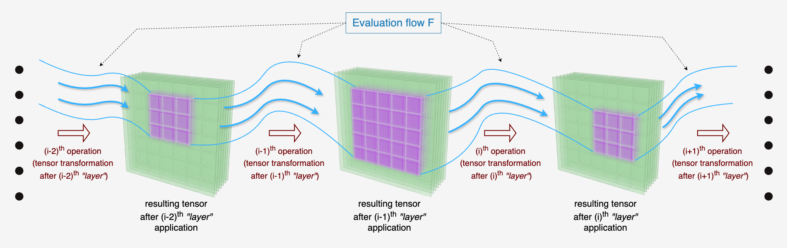
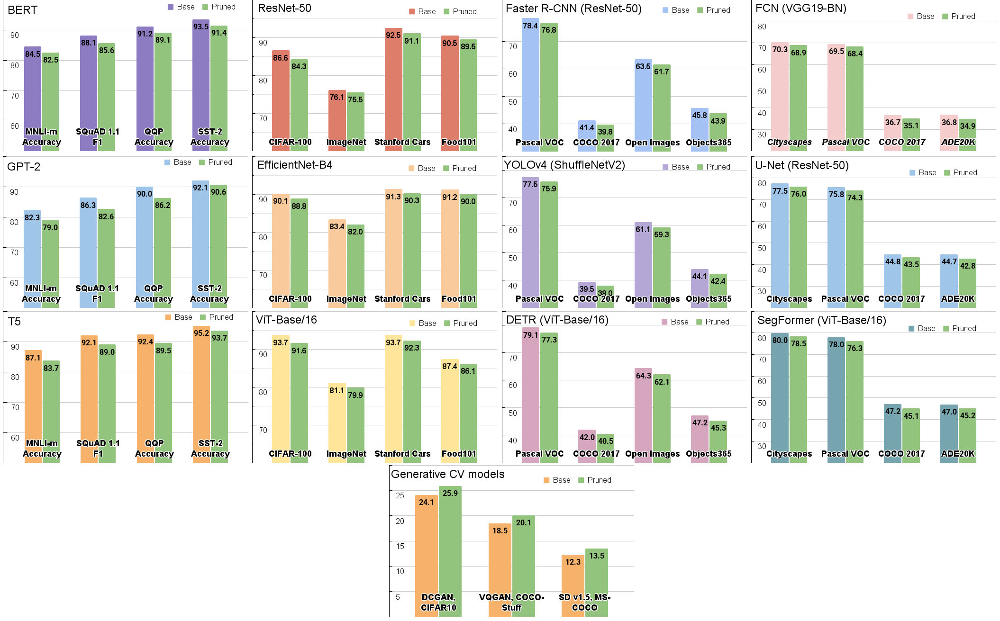

# Flow-Driven Model Compression: Architecture-Agnostic Neural Pruning Framework

This codebase provides the implementation supporting our paper, "Flow-Driven Model Compression: Architecture-Agnostic Neural Pruning Framework", submitted to the Twenty-Ninth Annual Conference on Artificial Intelligence and Statistics (AISTATS 2026).

The repository implements a pipeline for compressing neural network models using the IFAP (Iterative Flow-Aware Pruning) algorithm. The pipeline is designed to automate the process of pruning models across various model and dataset configurations.

## Flow Evaluation Scheme




## Project Structure
```
main.py                       # Entry point for the pipeline
requirements.txt              # Requirements file
configs/
    datasets.yaml             # Datasets configuration
    model_configs.yaml        # Model weights paths configuration
src/
    models/
      ...                     # Model definitions and utilities
    utils/
      ...                     # Utility functions
    visualization/
      ...                     # Visualization scripts
    process_pruning.py        # Main pruning logic
    ...                       # Other pruning-related modules
images/
    ...                         # Images for the README.md
```

## Getting Started

### Prerequisites
- Python 3.7+
- CUDA-compatible GPU
- Install required packages:

```bash
pip install -r requirements.txt
```

### Configuration
- Place your model weights paths in `configs/model_configs.yaml` under the `paths` key.
- List your datasets in `configs/datasets.yaml` under the `datasets` key.

Example `model_configs.yaml`:
```yaml
paths:
  - path/to/model1.pth
  - path/to/model2.pth
```

Example `datasets.yaml`:
```yaml
datasets:
  - dataset1
  - dataset2
```

### Running the Pipeline

1. Create and activate a virtual environment:
   ```bash
   python3 -m venv venv
   source venv/bin/activate
   ```
2. Install the required packages:
   ```bash
   pip install -r requirements.txt
   ```
3. Download the required datasets and place them in the appropriate directories as specified in `configs/datasets.yaml`.
4. Place your pretrained model weights in the directories specified in `configs/model_configs.yaml`.
5. Run the main pipeline script:
   ```bash
   python main.py
   ```
   Logs will be saved to `logs/ifap_pruning.log`.
6. After pruning and training, you can visualize the results using the scripts in the `visualization/` directory.

## Results

Below are the main results of our experiments.

Our experiments provide a comprehensive evaluation of the IFAP (Iterative Flow-Aware Pruning) algorithm across a wide range of neural network architectures and datasets.

The next table presents a comparison of pruning methods across vision and NLP models. We report baseline results along with the performance of various pruning approaches. For each dataset, the best pruned performance is highlighted in <b>bold</b>.

<table border="2" cellpadding="5" style="border-collapse: collapse; width: 100%; text-align: center;">
  <thead>
    <tr>
      <th colspan="5">CV Benchmarks</th>
      <th colspan="5">NLP Benchmarks</th>
    </tr>
    <tr>
      <th>Model</th>
      <th>Method</th>
      <th>CIFAR-10</th>
      <th>CIFAR-100</th>
      <th>ImageNet</th>
      <th>Model</th>
      <th>Method</th>
      <th>QQP</th>
      <th>MNLI-m</th>
      <th>SST-2</th>
    </tr>
  </thead>
  <tbody>
    <tr>
      <td>DenseNet-121</td>
      <td>Baseline</td>
      <td>94.2</td>
      <td>72.0</td>
      <td>74.7</td>
      <td>BERT</td>
      <td>Baseline</td>
      <td>91.2</td>
      <td>84.5</td>
      <td>93.5</td>
    </tr>
    <tr>
      <td></td>
      <td>LTH</td>
      <td>89.9</td>
      <td>65.1</td>
      <td>71.9</td>
      <td></td>
      <td>LTH</td>
      <td>88.2</td>
      <td>81.7</td>
      <td>91.2</td>
    </tr>
    <tr>
      <td></td>
      <td>PDP</td>
      <td>93.0</td>
      <td>69.6</td>
      <td>73.5</td>
      <td></td>
      <td>PDP</td>
      <td>89.2</td>
      <td>82.2</td>
      <td>91.3</td>
    </tr>
    <tr>
      <td></td>
      <td>GraNet</td>
      <td>91.8</td>
      <td>66.6</td>
      <td>73.2</td>
      <td></td>
      <td>MvP</td>
      <td>88.1</td>
      <td>80.5</td>
      <td>91.3</td>
    </tr>
    <tr>
      <td></td>
      <td>RigL</td>
      <td>92.5</td>
      <td>67.7</td>
      <td>73.1</td>
      <td></td>
      <td>RFP</td>
      <td>88.4</td>
      <td>81.1</td>
      <td>91.5</td>
    </tr>
    <tr>
      <td></td>
      <td>Ours</td>
      <td>92.5</td>
      <td>70.3</td>
      <td>74.1</td>
      <td></td>
      <td>Ours</td>
      <td>89.2</td>
      <td>82.6</td>
      <td>91.7</td>
    </tr>
    <tr><td colspan="10" style="background:#f4f4f4;"></td></tr>
    <tr>
      <td>ResNet-50</td>
      <td>Baseline</td>
      <td>98.2</td>
      <td>86.6</td>
      <td>76.1</td>
      <td>GPT-2</td>
      <td>Baseline</td>
      <td>87.1</td>
      <td>82.3</td>
      <td>92.1</td>
    </tr>
    <tr>
      <td></td>
      <td>LTH</td>
      <td>92.7</td>
      <td>75.7</td>
      <td>73.2</td>
      <td></td>
      <td>LTH</td>
      <td>85.3</td>
      <td>78.5</td>
      <td>89.8</td>
    </tr>
    <tr>
      <td></td>
      <td>PDP</td>
      <td>95.4</td>
      <td>81.5</td>
      <td>75.2</td>
      <td></td>
      <td>PDP</td>
      <td>86.5</td>
      <td>79.2</td>
      <td>90.8</td>
    </tr>
    <tr>
      <td></td>
      <td>GraNet</td>
      <td>94.8</td>
      <td>78.4</td>
      <td>74.7</td>
      <td></td>
      <td>MvP</td>
      <td>86.1</td>
      <td>79.2</td>
      <td>89.8</td>
    </tr>
    <tr>
      <td></td>
      <td>RigL</td>
      <td>94.1</td>
      <td>77.2</td>
      <td>74.9</td>
      <td></td>
      <td>RFP</td>
      <td>85.5</td>
      <td>78.6</td>
      <td>90.2</td>
    </tr>
    <tr>
      <td></td>
      <td>Ours</td>
      <td>96.2</td>
      <td>84.3</td>
      <td>75.5</td>
      <td></td>
      <td>Ours</td>
      <td>86.2</td>
      <td>79.2</td>
      <td>90.9</td>
    </tr>
    <tr><td colspan="10" style="background:#f4f4f4;"></td></tr>
    <tr>
      <td>ViT-Base/16</td>
      <td>Baseline</td>
      <td>98.6</td>
      <td>93.7</td>
      <td>81.1</td>
      <td>T5</td>
      <td>Baseline</td>
      <td>92.4</td>
      <td>87.1</td>
      <td>95.2</td>
    </tr>
    <tr>
      <td></td>
      <td>LTH</td>
      <td>95.6</td>
      <td>87.9</td>
      <td>78.7</td>
      <td></td>
      <td>LTH</td>
      <td>87.8</td>
      <td>83.2</td>
      <td>93.1</td>
    </tr>
    <tr>
      <td></td>
      <td>PDP</td>
      <td>97.2</td>
      <td>91.1</td>
      <td>79.8</td>
      <td></td>
      <td>PDP</td>
      <td>89.4</td>
      <td>83.8</td>
      <td>94.2</td>
    </tr>
    <tr>
      <td></td>
      <td>GraNet</td>
      <td>96.3</td>
      <td>89.8</td>
      <td>78.3</td>
      <td></td>
      <td>MvP</td>
      <td>89.1</td>
      <td>83.0</td>
      <td>93.1</td>
    </tr>
    <tr>
      <td></td>
      <td>RigL</td>
      <td>96.6</td>
      <td>89.6</td>
      <td>78.8</td>
      <td></td>
      <td>RFP</td>
      <td>88.9</td>
      <td>82.9</td>
      <td>93.5</td>
    </tr>
    <tr>
      <td></td>
      <td>Ours</td>
      <td>97.0</td>
      <td>91.6</td>
      <td>79.9</td>
      <td></td>
      <td>Ours</td>
      <td>89.4</td>
      <td>84.0</td>
      <td>93.9</td>
    </tr>
  </tbody>
</table>

<div style="overflow-x: auto; margin: 20px 0;">
<table border="2" style="width: 100%;">
  <caption style="font-weight: bold; font-size: 1.1em; margin-bottom: 10px; text-align: center;">
    Table II. Comparative pruning results across different architectures and datasets. Image Classification Task
  </caption>
  <thead>
    <tr style="background-color: #f2f2f2;">
      <th rowspan="2" style="text-align: left;">Dataset</th>
      <th rowspan="2" style="text-align: left;">Architecture</th>
      <th colspan="3">GFlops</th>
      <th colspan="3">Top-1 Acc</th>
    </tr>
    <tr style="background-color: #f2f2f2;">
      <th>Base</th>
      <th>Pruned</th>
      <th>↓%</th>
      <th>Base</th>
      <th>Pruned</th>
      <th>↓%</th>
    </tr>
  </thead>
  <tbody>
    <tr>
      <td rowspan="10" style="vertical-align: top; font-weight: bold;">CIFAR-10</td>
      <td style="background-color: #f7f7f7;">DenseNet-121</td><td style="background-color: #f7f7f7;">2.8</td><td style="background-color: #f7f7f7;">0.9</td><td style="background-color: #f7f7f7;">-68</td><td style="background-color: #f7f7f7;">94.20</td><td style="background-color: #f7f7f7;">94.03</td><td style="background-color: #f7f7f7;">-0.18</td>
    </tr>
    <tr>
      <td>VGG19 (BN)</td><td>19.6</td><td>5.9</td><td>-70</td><td>93.46</td><td>92.91</td><td>-0.58</td>
    </tr>
    <tr>
      <td style="background-color: #f7f7f7;">ResNet-50</td><td style="background-color: #f7f7f7;">4.1</td><td style="background-color: #f7f7f7;">1.2</td><td style="background-color: #f7f7f7;">-71</td><td style="background-color: #f7f7f7;">98.19</td><td style="background-color: #f7f7f7;">97.63</td><td style="background-color: #f7f7f7;">-0.57</td>
    </tr>
    <tr>
      <td>Inception-v3</td><td>5.7</td><td>1.7</td><td>-70</td><td>95.33</td><td>94.87</td><td>-0.48</td>
    </tr>
    <tr>
      <td style="background-color: #f7f7f7;">MobileNetV3-L</td><td style="background-color: #f7f7f7;">0.2</td><td style="background-color: #f7f7f7;">0.1</td><td style="background-color: #f7f7f7;">-43</td><td style="background-color: #f7f7f7;">89.80</td><td style="background-color: #f7f7f7;">89.34</td><td style="background-color: #f7f7f7;">-0.52</td>
    </tr>
    <tr>
      <td>ShuffleNetV2 x2.0</td><td>0.5</td><td>0.1</td><td>-81</td><td>90.45</td><td>89.95</td><td>-0.55</td>
    </tr>
    <tr>
      <td style="background-color: #f7f7f7;">ConvNeXt-Small</td><td style="background-color: #f7f7f7;">8.6</td><td style="background-color: #f7f7f7;">2.3</td><td style="background-color: #f7f7f7;">-73</td><td style="background-color: #f7f7f7;">94.21</td><td style="background-color: #f7f7f7;">93.78</td><td style="background-color: #f7f7f7;">-0.45</td>
    </tr>
    <tr>
      <td>EfficientNet-B4</td><td>4.2</td><td>1.5</td><td>-64</td><td>96.90</td><td>96.51</td><td>-0.41</td>
    </tr>
    <tr>
      <td style="background-color: #f7f7f7;">EfficientNet V2-S</td><td style="background-color: #f7f7f7;">8.8</td><td style="background-color: #f7f7f7;">2.9</td><td style="background-color: #f7f7f7;">-67</td><td style="background-color: #f7f7f7;">97.12</td><td style="background-color: #f7f7f7;">96.79</td><td style="background-color: #f7f7f7;">-0.33</td>
    </tr>
    <tr>
      <td>ViT-Base/16</td><td>17.5</td><td>5.1</td><td>-71</td><td>98.61</td><td>98.18</td><td>-0.44</td>
    </tr>
    <!-- CIFAR-100 -->
    <tr style="border-top: 2px solid #333;">
      <td rowspan="10" style="vertical-align: top; font-weight: bold;">CIFAR-100</td>
      <td style="background-color: #f7f7f7;">DenseNet-121</td><td style="background-color: #f7f7f7;">2.8</td><td style="background-color: #f7f7f7;">1.0</td><td style="background-color: #f7f7f7;">-64</td><td style="background-color: #f7f7f7;">72.07</td><td style="background-color: #f7f7f7;">71.29</td><td style="background-color: #f7f7f7;">-1.07</td>
    </tr>
    <tr>
      <td>VGG19 (BN)</td><td>19.6</td><td>6.8</td><td>-65</td><td>73.89</td><td>72.57</td><td>-1.79</td>
    </tr>
    <tr>
      <td style="background-color: #f7f7f7;">ResNet-50</td><td style="background-color: #f7f7f7;">4.1</td><td style="background-color: #f7f7f7;">1.3</td><td style="background-color: #f7f7f7;">-68</td><td style="background-color: #f7f7f7;">86.61</td><td style="background-color: #f7f7f7;">85.09</td><td style="background-color: #f7f7f7;">-1.76</td>
    </tr>
    <tr>
      <td>Inception-v3</td><td>5.7</td><td>1.9</td><td>-67</td><td>82.15</td><td>80.62</td><td>-1.86</td>
    </tr>
    <tr>
      <td style="background-color: #f7f7f7;">MobileNetV3-L</td><td style="background-color: #f7f7f7;">0.2</td><td style="background-color: #f7f7f7;">0.1</td><td style="background-color: #f7f7f7;">-54</td><td style="background-color: #f7f7f7;">77.70</td><td style="background-color: #f7f7f7;">76.93</td><td style="background-color: #f7f7f7;">-1.00</td>
    </tr>
    <tr>
      <td>ShuffleNetV2 x2.0</td><td>0.5</td><td>0.2</td><td>-61</td><td>75.33</td><td>74.16</td><td>-1.55</td>
    </tr>
    <tr>
      <td style="background-color: #f7f7f7;">ConvNeXt-Small</td><td style="background-color: #f7f7f7;">8.6</td><td style="background-color: #f7f7f7;">2.5</td><td style="background-color: #f7f7f7;">-71</td><td style="background-color: #f7f7f7;">85.59</td><td style="background-color: #f7f7f7;">84.09</td><td style="background-color: #f7f7f7;">-1.75</td>
    </tr>
    <tr>
      <td>EfficientNet-B4</td><td>4.2</td><td>1.7</td><td>-60</td><td>90.12</td><td>88.84</td><td>-1.42</td>
    </tr>
    <tr>
      <td style="background-color: #f7f7f7;">EfficientNet V2-S</td><td style="background-color: #f7f7f7;">8.8</td><td style="background-color: #f7f7f7;">3.2</td><td style="background-color: #f7f7f7;">-64</td><td style="background-color: #f7f7f7;">88.44</td><td style="background-color: #f7f7f7;">87.13</td><td style="background-color: #f7f7f7;">-1.48</td>
    </tr>
    <tr>
      <td>ViT-Base/16</td><td>17.5</td><td>6.8</td><td>-61</td><td>94.24</td><td>93.16</td><td>-1.15</td>
    </tr>
    <!-- Fashion MNIST -->
    <tr style="border-top: 2px solid #333;">
      <td rowspan="10" style="vertical-align: top; font-weight: bold;">Fashion MNIST</td>
      <td style="background-color: #f7f7f7;">DenseNet-121</td><td style="background-color: #f7f7f7;">2.8</td><td style="background-color: #f7f7f7;">1.0</td><td style="background-color: #f7f7f7;">-64</td><td style="background-color: #f7f7f7;">93.00</td><td style="background-color: #f7f7f7;">92.29</td><td style="background-color: #f7f7f7;">-0.77</td>
    </tr>
    <tr>
      <td>VGG19 (BN)</td>
      <td>19.6</td>
      <td>5.4</td>
      <td>-72</td>
      <td>91.77</td>
      <td>91.13</td>
      <td>-0.69</td>
    </tr>
    <tr>
      <td style="background-color: #f7f7f7;">ResNet-50</td>
      <td style="background-color: #f7f7f7;">4.1</td>
      <td style="background-color: #f7f7f7;">1.1</td>
      <td style="background-color: #f7f7f7;">-73</td>
      <td style="background-color: #f7f7f7;">93.18</td>
      <td style="background-color: #f7f7f7;">92.73</td>
      <td style="background-color: #f7f7f7;">-0.45</td>
    </tr>
    <tr>
      <td>Inception-v3</td>
      <td>5.7</td>
      <td>1.6</td>
      <td>-72</td>
      <td>92.78</td>
      <td>92.30</td>
      <td>-0.52</td>
    </tr>
    <tr>
      <td style="background-color: #f7f7f7;">MobileNetV3-L</td>
      <td style="background-color: #f7f7f7;">0.2</td>
      <td style="background-color: #f7f7f7;">0.1</td>
      <td style="background-color: #f7f7f7;">-55</td>
      <td style="background-color: #f7f7f7;">89.80</td>
      <td style="background-color: #f7f7f7;">89.34</td>
      <td style="background-color: #f7f7f7;">-0.46</td>
    </tr>
    <tr>
      <td>ShuffleNetV2 x2.0</td>
      <td>0.5</td>
      <td>0.1</td>
      <td>-78</td>
      <td>90.89</td>
      <td>90.31</td>
      <td>-0.58</td>
    </tr>
    <tr>
      <td style="background-color: #f7f7f7;">ConvNeXt-Small</td>
      <td style="background-color: #f7f7f7;">8.6</td>
      <td style="background-color: #f7f7f7;">3.5</td>
      <td style="background-color: #f7f7f7;">-59</td>
      <td style="background-color: #f7f7f7;">89.66</td>
      <td style="background-color: #f7f7f7;">89.27</td>
      <td style="background-color: #f7f7f7;">-0.90</td>
    </tr>
    <tr>
      <td>EfficientNet-B4</td><td>4.2</td><td>1.6</td><td>-62</td><td>94.97</td><td>94.54</td><td>-0.46</td>
    </tr>
    <tr>
      <td style="background-color: #f7f7f7;">EfficientNet V2-S</td>
      <td style="background-color: #f7f7f7;">8.8</td>
      <td style="background-color: #f7f7f7;">2.8</td>
      <td style="background-color: #f7f7f7;">-68</td>
      <td style="background-color: #f7f7f7;">95.35</td>
      <td style="background-color: #f7f7f7;">94.88</td>
      <td style="background-color: #f7f7f7;">-0.49</td>
    </tr>
    <tr>
      <td>ViT-Base/16</td><td>17.5</td><td>6.4</td><td>-63</td><td>94.80</td><td>94.30</td><td>-0.47</td>
    </tr>
    <!-- ImageNet -->
    <tr style="border-top: 2px solid #333;">
      <td rowspan="10" style="vertical-align: top; font-weight: bold;">ImageNet</td>
      <td style="background-color: #f7f7f7;">DenseNet-121</td><td style="background-color: #f7f7f7;">2.8</td><td style="background-color: #f7f7f7;">1.0</td><td style="background-color: #f7f7f7;">-65</td><td style="background-color: #f7f7f7;">74.65</td><td style="background-color: #f7f7f7;">73.96</td><td style="background-color: #f7f7f7;">-0.92</td>
    </tr>
    <tr>
      <td>VGG19 (BN)</td><td>19.6</td><td>7.2</td><td>-63</td><td>73.12</td><td>71.62</td><td>-1.50</td>
    </tr>
    <tr>
      <td style="background-color: #f7f7f7;">ResNet-50</td><td style="background-color: #f7f7f7;">4.1</td><td style="background-color: #f7f7f7;">1.6</td><td style="background-color: #f7f7f7;">-61</td><td style="background-color: #f7f7f7;">76.14</td><td style="background-color: #f7f7f7;">75.19</td><td style="background-color: #f7f7f7;">-1.25</td>
    </tr>
    <tr>
      <td>Inception-v3</td><td>5.7</td><td>2.1</td><td>-63</td><td>77.16</td><td>75.86</td><td>-1.69</td>
    </tr>
    <tr>
      <td style="background-color: #f7f7f7;">MobileNetV3-L</td><td style="background-color: #f7f7f7;">0.2</td><td style="background-color: #f7f7f7;">0.1</td>
      <td style="background-color: #f7f7f7;">-53</td><td style="background-color: #f7f7f7;">74.03</td><td style="background-color: #f7f7f7;">72.83</td><td style="background-color: #f7f7f7;">-1.63</td>
    </tr>
    <tr>
      <td>ShuffleNetV2 x2.0</td><td>0.5</td><td>0.2</td><td>-60</td><td>76.22</td><td>74.85</td><td>-1.37</td>
    </tr>
    <tr>
      <td style="background-color: #f7f7f7;">ConvNeXt-Small</td><td style="background-color: #f7f7f7;">8.6</td><td style="background-color: #f7f7f7;">2.6</td><td style="background-color: #f7f7f7;">-70</td><td style="background-color: #f7f7f7;">82.06</td><td style="background-color: #f7f7f7;">80.99</td><td style="background-color: #f7f7f7;">-1.82</td>
    </tr>
    <tr>
      <td>EfficientNet-B4</td><td>4.2</td><td>1.6</td><td>-62</td><td>83.37</td><td>81.71</td><td>-1.66</td>
    </tr>
    <tr>
      <td style="background-color: #f7f7f7;">EfficientNet V2-S</td><td style="background-color: #f7f7f7;">8.8</td><td style="background-color: #f7f7f7;">3.4</td><td style="background-color: #f7f7f7;">-61</td><td style="background-color: #f7f7f7;">84.21</td><td style="background-color: #f7f7f7;">82.82</td><td style="background-color: #f7f7f7;">-1.66</td>
    </tr>
    <tr>
      <td>ViT-Base/16</td><td>17.5</td><td>6.9</td><td>-61</td><td>80.17</td><td>79.85</td><td>-1.51</td>
    </tr>
    <tr style="border-top: 2px solid #333;">
      <td rowspan="10" style="vertical-align: top; font-weight: bold;">Stanford Cars</td>
      <td style="background-color: #f7f7f7;">DenseNet-121</td><td style="background-color: #f7f7f7;">2.8</td><td style="background-color: #f7f7f7;">1.0</td><td style="background-color: #f7f7f7;">-64</td><td style="background-color: #f7f7f7;">83.13</td><td style="background-color: #f7f7f7;">81.95</td><td style="background-color: #f7f7f7;">-1.18</td>
    </tr>
    <tr>
      <td>VGG19 (BN)</td><td>19.6</td><td>7.1</td><td>-64</td><td>86.99</td><td>85.70</td><td>-1.29</td>
    </tr>
    <tr>
      <td style="background-color: #f7f7f7;">ResNet-50</td><td style="background-color: #f7f7f7;">4.1</td><td style="background-color: #f7f7f7;">1.4</td><td style="background-color: #f7f7f7;">-66</td><td style="background-color: #f7f7f7;">92.52</td><td style="background-color: #f7f7f7;">90.99</td><td style="background-color: #f7f7f7;">-1.53</td>
    </tr>
    <tr>
      <td>Inception-v3</td><td>5.7</td><td>2.0</td><td>-65</td><td>83.86</td><td>82.27</td><td>-1.67</td>
    </tr>
    <tr>
      <td style="background-color: #f7f7f7;">MobileNetV3-L</td><td style="background-color: #f7f7f7;">0.2</td><td style="background-color: #f7f7f7;">0.1</td><td style="background-color: #f7f7f7;">-45</td><td style="background-color: #f7f7f7;">68.32</td><td style="background-color: #f7f7f7;">67.43</td><td style="background-color: #f7f7f7;">-1.29</td>
    </tr>
    <tr>
      <td>ShuffleNetV2 x2.0</td><td>0.5</td><td>0.2</td><td>-57</td><td>82.56</td><td>81.39</td><td>-1.42</td>
    </tr>
    <tr>
      <td style="background-color: #f7f7f7;">ConvNeXt-Small</td><td style="background-color: #f7f7f7;">8.6</td><td style="background-color: #f7f7f7;">2.9</td><td style="background-color: #f7f7f7;">-66</td><td style="background-color: #f7f7f7;">86.22</td><td style="background-color: #f7f7f7;">81.21</td><td style="background-color: #f7f7f7;">-1.18</td>
    </tr>
    <tr>
      <td>EfficientNet-B4</td><td>4.2</td><td>1.6</td><td>-60</td><td>91.34</td><td>90.06</td><td>-1.28</td>
    </tr>
    <tr>
      <td style="background-color: #f7f7f7;">EfficientNet V2-S</td><td style="background-color: #f7f7f7;">8.8</td><td style="background-color: #f7f7f7;">3.3</td><td style="background-color: #f7f7f7;">-63</td><td style="background-color: #f7f7f7;">90.24</td><td style="background-color: #f7f7f7;">89.61</td><td style="background-color: #f7f7f7;">-0.63</td>
    </tr>
    <tr>
      <td>ViT-Base/16</td><td>17.5</td><td>6.9</td><td>-61</td><td>93.73</td><td>92.21</td><td>-1.62</td>
    </tr>    
    <tr style="border-top: 2px solid #333;">
      <td rowspan="10" style="vertical-align: top; font-weight: bold;">iNaturalist</td>
      <td style="background-color: #f7f7f7;">DenseNet-121</td><td style="background-color: #f7f7f7;">2.8</td><td style="background-color: #f7f7f7;">1.0</td><td style="background-color: #f7f7f7;">-64</td><td style="background-color: #f7f7f7;">69.75</td><td style="background-color: #f7f7f7;">68.73</td><td style="background-color: #f7f7f7;">-1.46</td>
    </tr>
    <tr>
      <td>VGG19 (BN)</td><td>19.6</td><td>6.9</td><td>-65</td><td>67.20</td><td>65.43</td><td>-1.77</td>
    </tr>
    <tr>
      <td style="background-color: #f7f7f7;">ResNet-50</td><td style="background-color: #f7f7f7;">4.1</td><td style="background-color: #f7f7f7;">1.6</td><td style="background-color: #f7f7f7;">-61</td><td style="background-color: #f7f7f7;">76.15</td><td style="background-color: #f7f7f7;">74.68</td><td style="background-color: #f7f7f7;">-1.93</td>
    </tr>
    <tr>
      <td>Inception-v3</td><td>5.7</td><td>2.1</td><td>-63</td><td>72.35</td><td>71.13</td><td>-1.22</td>
    </tr>
    <tr>
      <td style="background-color: #f7f7f7;">MobileNetV3-L</td><td style="background-color: #f7f7f7;">0.2</td><td style="background-color: #f7f7f7;">0.1</td><td style="background-color: #f7f7f7;">-45</td><td style="background-color: #f7f7f7;">68.31</td><td style="background-color: #f7f7f7;">67.43</td><td style="background-color: #f7f7f7;">-1.29</td>
    </tr>
    <tr>
      <td>ShuffleNetV2 x2.0</td><td>0.5</td><td>0.2</td><td>-58</td><td>66.77</td><td>65.58</td><td>-1.78</td>
    </tr>
    <tr>
      <td style="background-color: #f7f7f7;">ConvNeXt-Small</td><td style="background-color: #f7f7f7;">8.6</td><td style="background-color: #f7f7f7;">3.4</td><td style="background-color: #f7f7f7;">-60</td><td style="background-color: #f7f7f7;">68.90</td><td style="background-color: #f7f7f7;">67.43</td><td style="background-color: #f7f7f7;">-1.47</td>
    </tr>
    <tr>
      <td>EfficientNet-B4</td><td>4.2</td><td>1.6</td><td>-62</td><td>70.58</td><td>68.64</td><td>-1.28</td>
    </tr>
    <tr>
      <td style="background-color: #f7f7f7;">EfficientNet V2-S</td><td style="background-color: #f7f7f7;">8.8</td><td style="background-color: #f7f7f7;">3.4</td><td style="background-color: #f7f7f7;">-63</td><td style="background-color: #f7f7f7;">74.30</td><td style="background-color: #f7f7f7;">73.10</td><td style="background-color: #f7f7f7;">-1.20</td>
    </tr>
    <tr>
      <td>ViT-Base/16</td><td>17.5</td><td>6.9</td><td>-61</td><td>68.66</td><td>67.83</td><td>-1.21</td>
    </tr>
  <tr style="border-top: 2px solid #333;">
    <td rowspan="10" style="vertical-align: top; font-weight: bold;">Food101</td>
    <td style="background-color: #f7f7f7;">DenseNet-121</td><td style="background-color: #f7f7f7;">2.8</td><td style="background-color: #f7f7f7;">0.9</td><td style="background-color: #f7f7f7;">-68</td><td style="background-color: #f7f7f7;">87.35</td><td style="background-color: #f7f7f7;">85.70</td><td style="background-color: #f7f7f7;">-1.89</td>
  </tr>
  <tr>
    <td>VGG19 (BN)</td><td>19.6</td><td>6.3</td><td>-68</td><td>86.32</td><td>84.32</td><td>-1.57</td>
  </tr>
  <tr>
    <td style="background-color: #f7f7f7;">ResNet-50</td><td style="background-color: #f7f7f7;">4.1</td><td style="background-color: #f7f7f7;">1.5</td><td style="background-color: #f7f7f7;">-63</td><td style="background-color: #f7f7f7;">90.46</td><td style="background-color: #f7f7f7;">89.30</td><td style="background-color: #f7f7f7;">-1.16</td>
  </tr>
  <tr>
    <td>Inception-v3</td><td>5.7</td><td>2.0</td><td>-65</td><td>88.12</td><td>86.78</td><td>-1.52</td>
  </tr>
  <tr>
    <td style="background-color: #f7f7f7;">MobileNetV3-L</td><td style="background-color: #f7f7f7;">0.2</td><td style="background-color: #f7f7f7;">0.1</td><td style="background-color: #f7f7f7;">-53</td><td style="background-color: #f7f7f7;">86.05</td><td style="background-color: #f7f7f7;">83.75</td><td style="background-color: #f7f7f7;">-2.30</td>
  </tr>
  <tr>
    <td>ShuffleNetV2 x2.0</td><td>0.5</td><td>0.2</td><td>-58</td><td>84.23</td><td>82.84</td><td>-1.39</td>
  </tr>
  <tr>
    <td style="background-color: #f7f7f7;">ConvNeXt-Small</td><td style="background-color: #f7f7f7;">8.6</td><td style="background-color: #f7f7f7;">3.6</td><td style="background-color: #f7f7f7;">-58</td><td style="background-color: #f7f7f7;">86.25</td><td style="background-color: #f7f7f7;">83.75</td><td style="background-color: #f7f7f7;">-2.50</td>
  </tr>
  <tr>
    <td>EfficientNet-B4</td><td>4.2</td><td>1.6</td><td>-62</td><td>90.36</td><td>89.05</td><td>-1.31</td>
  </tr>
  <tr>
    <td style="background-color: #f7f7f7;">EfficientNet V2-S</td><td style="background-color: #f7f7f7;">8.8</td><td style="background-color: #f7f7f7;">3.2</td><td style="background-color: #f7f7f7;">-64</td><td style="background-color: #f7f7f7;">90.56</td><td style="background-color: #f7f7f7;">89.29</td><td style="background-color: #f7f7f7;">-1.40</td>
  </tr>
  <tr>
    <td>ViT-Base/16</td><td>17.5</td><td>6.7</td><td>-62</td><td>87.44</td><td>86.14</td><td>-1.45</td>
  </tr>
  <tr style="border-top: 2px solid #333;">
    <td rowspan="10" style="vertical-align: top; font-weight: bold;">Oxford-IIIT Pet</td>
    <td style="background-color: #f7f7f7;">DenseNet-121</td><td style="background-color: #f7f7f7;">2.8</td><td style="background-color: #f7f7f7;">0.8</td><td style="background-color: #f7f7f7;">-71</td><td style="background-color: #f7f7f7;">85.24</td><td style="background-color: #f7f7f7;">84.20</td><td style="background-color: #f7f7f7;">-1.22</td>
    </tr>
    <tr>
      <td>VGG19 (BN)</td><td>19.6</td><td>6.7</td><td>-66</td><td>85.20</td><td>85.20</td><td>-1.44</td>
    </tr>
    <tr>
      <td style="background-color: #f7f7f7;">ResNet-50</td><td style="background-color: #f7f7f7;">4.1</td><td style="background-color: #f7f7f7;">1.6</td><td style="background-color: #f7f7f7;">-61</td><td style="background-color: #f7f7f7;">93.11</td><td style="background-color: #f7f7f7;">92.88</td><td style="background-color: #f7f7f7;">-0.26</td>
    </tr>
    <tr>
      <td>Inception-v3</td><td>5.7</td><td>1.9</td><td>-66</td><td>89.34</td><td>88.17</td><td>-1.31</td>
    </tr>
    <tr>
      <td style="background-color: #f7f7f7;">MobileNetV3-L</td><td style="background-color: #f7f7f7;">0.2</td><td style="background-color: #f7f7f7;">0.1</td><td style="background-color: #f7f7f7;">-45</td><td style="background-color: #f7f7f7;">85.53</td><td style="background-color: #f7f7f7;">84.52</td><td style="background-color: #f7f7f7;">-1.19</td>
    </tr>
    <tr>
      <td>ShuffleNetV2 x2.0</td><td>0.5</td><td>0.2</td><td>-63</td><td>83.67</td><td>82.43</td><td>-1.49</td>
    </tr>
    <tr>
      <td style="background-color: #f7f7f7;">ConvNeXt-Small</td><td style="background-color: #f7f7f7;">8.6</td><td style="background-color: #f7f7f7;">3.1</td><td style="background-color: #f7f7f7;">-64</td><td style="background-color: #f7f7f7;">84.08</td><td style="background-color: #f7f7f7;">83.00</td><td style="background-color: #f7f7f7;">-1.29</td>
    </tr>
    <tr>
      <td>EfficientNet-B4</td><td>4.2</td><td>1.7</td><td>-60</td><td>87.85</td><td>86.98</td><td>-0.99</td>
    </tr>
    <tr>
      <td style="background-color: #f7f7f7;">EfficientNet V2-S</td><td style="background-color: #f7f7f7;">8.8</td><td style="background-color: #f7f7f7;">3.6</td><td style="background-color: #f7f7f7;">-59</td><td style="background-color: #f7f7f7;">88.36</td><td style="background-color: #f7f7f7;">88.19</td><td style="background-color: #f7f7f7;">-0.17</td>
    </tr>
    <tr>
      <td>ViT-Base/16</td><td>17.5</td><td>5.9</td><td>-66</td><td>89.58</td><td>88.21</td><td>-1.37</td>
    </tr>
  <tr style="border-top: 2px solid #333;">
    <td rowspan="10" style="vertical-align: top; font-weight: bold;">FER2013</td>
    <td style="background-color: #f7f7f7;">DenseNet-121</td><td style="background-color: #f7f7f7;">2.8</td><td style="background-color: #f7f7f7;">0.9</td><td style="background-color: #f7f7f7;">-68</td><td style="background-color: #f7f7f7;">65.13</td><td style="background-color: #f7f7f7;">64.17</td><td style="background-color: #f7f7f7;">-1.47</td>
    </tr>
    <tr>
      <td>VGG19 (BN)</td><td>19.6</td><td>6.8</td><td>-65</td><td>68.34</td><td>67.10</td><td>-1.81</td>
    </tr>
    <tr>
      <td style="background-color: #f7f7f7;">ResNet-50</td><td style="background-color: #f7f7f7;">4.1</td><td style="background-color: #f7f7f7;">1.4</td><td style="background-color: #f7f7f7;">-66</td><td style="background-color: #f7f7f7;">71.81</td><td style="background-color: #f7f7f7;">70.66</td><td style="background-color: #f7f7f7;">-1.60</td>
    </tr>
    <tr>
      <td>Inception-v3</td><td>5.7</td><td>2.0</td><td>-65</td><td>70.46</td><td>69.11</td><td>-1.91</td>
    </tr>
    <tr>
      <td style="background-color: #f7f7f7;">MobileNetV3-L</td><td style="background-color: #f7f7f7;">0.2</td><td style="background-color: #f7f7f7;">0.1</td><td style="background-color: #f7f7f7;">-42</td><td style="background-color: #f7f7f7;">69.88</td><td style="background-color: #f7f7f7;">67.43</td><td style="background-color: #f7f7f7;">-2.45</td>
    </tr>
    <tr>
      <td>ShuffleNetV2 x2.0</td><td>0.5</td><td>0.2</td><td>-58</td><td>67.45</td><td>66.25</td><td>-1.20</td>
    </tr>
    <tr>
      <td style="background-color: #f7f7f7;">ConvNeXt-Small</td><td style="background-color: #f7f7f7;">8.6</td><td style="background-color: #f7f7f7;">3.0</td><td style="background-color: #f7f7f7;">-64</td><td style="background-color: #f7f7f7;">76.10</td><td style="background-color: #f7f7f7;">74.84</td><td style="background-color: #f7f7f7;">-1.26</td>
    </tr>
    <tr>
      <td>EfficientNet-B4</td><td>4.2</td><td>1.6</td><td>-62</td><td>74.16</td><td>73.27</td><td>-0.89</td>
    </tr>
    <tr>
      <td style="background-color: #f7f7f7;">EfficientNet V2-S</td><td style="background-color: #f7f7f7;">8.8</td><td style="background-color: #f7f7f7;">3.3</td><td style="background-color: #f7f7f7;">-62</td><td style="background-color: #f7f7f7;">76.89</td><td style="background-color: #f7f7f7;">75.48</td><td style="background-color: #f7f7f7;">-1.83</td>
    </tr>
    <tr>
      <td>ViT-Base/16</td><td>17.5</td><td>6.3</td><td>-64</td><td>70.21</td><td>68.97</td><td>-1.76</td>
    </tr>

<table border="2" style="border-collapse: collapse; width: 100%; text-align: center;">
    <caption style="caption-side: top; font-weight: bold; padding: 8px;">
        Table III. Pruning results across Vision Tasks
    </caption>
    <thead>
        <tr>
        <th>Dataset</th>
        <th>Architecture</th>
        <th class="num">GFlops (Base)</th>
        <th class="num">GFlops (Pruned)</th>
        <th class="num">Δ%</th>
        <th class="num">Metric (Base)</th>
        <th class="num">Metric (Pruned)</th>
        <th class="num">Δ%</th>
        </tr>
    </thead>
    <tbody>
        <tr class="section" style="font-weight: bold;"><td colspan="8">Image Classification Task (Metric: Top-1 Accuracy, %)</td></tr>
        <tr>
            <td data-label="Dataset">CIFAR-100</td>
            <td data-label="Architecture">ResNet-50</td>
            <td class="num" data-label="GFlops (Base)">4.1</td>
            <td class="num" data-label="GFlops (Pruned)">1.3</td>
            <td class="num negative" data-label="Δ%">-68</td>
            <td class="num" data-label="Metric (Base)">86.6</td>
            <td class="num" data-label="Metric (Pruned)">85.1</td>
            <td class="num negative" data-label="Δ%">-1.8</td>
        </tr>
        <tr>
            <td> </td>
            <td>ShuffleNetV2 x2.0</td>
            <td class="num">0.5</td>
            <td class="num">0.2</td>
            <td class="num negative">-61</td>
            <td class="num">75.3</td>
            <td class="num">74.2</td>
            <td class="num negative">-1.5</td>
        </tr>
        <tr>
            <td> </td>
            <td>EfficientNet-B4</td>
            <td class="num">4.2</td>
            <td class="num">1.7</td>
            <td class="num negative">-60</td>
            <td class="num">90.1</td>
            <td class="num">88.8</td>
            <td class="num negative">-1.4</td>
        </tr>
        <tr>
            <td> </td>
            <td>ViT-Base/16</td>
            <td class="num">17.5</td>
            <td class="num">6.8</td>
            <td class="num negative">-61</td>
            <td class="num">94.2</td>
            <td class="num">93.2</td>
            <td class="num negative">-1.2</td>
        </tr>
        <tr>
            <td>ImageNet</td>
            <td>ResNet-50</td>
            <td class="num">4.1</td>
            <td class="num">1.6</td>
            <td class="num negative">-61</td>
            <td class="num">76.1</td>
            <td class="num">75.2</td>
            <td class="num negative">-1.2</td>
        </tr>
        <tr>
            <td> </td>
            <td>ShuffleNetV2 x2.0</td>
            <td class="num">0.5</td>
            <td class="num">0.2</td>
            <td class="num negative">-60</td>
            <td class="num">76.2</td>
            <td class="num">75.2</td>
            <td class="num negative">-1.4</td>
        </tr>
        <tr>
            <td> </td>
            <td>EfficientNet-B4</td>
            <td class="num">4.2</td>
            <td class="num">1.6</td>
            <td class="num negative">-62</td>
            <td class="num">83.4</td>
            <td class="num">82.0</td>
            <td class="num negative">-1.7</td>
        </tr>
        <tr>
            <td> </td>
            <td>ViT-Base/16</td>
            <td class="num">17.5</td>
            <td class="num">6.9</td>
            <td class="num negative">-61</td>
            <td class="num">81.1</td>
            <td class="num">79.9</td>
            <td class="num negative">-1.5</td>
        </tr>
        <tr>
            <td>Stanford Cars</td>
            <td>ResNet-50</td>
            <td class="num">4.1</td>
            <td class="num">1.4</td>
            <td class="num negative">-66</td>
            <td class="num">92.5</td>
            <td class="num">91.0</td>
            <td class="num negative">-1.7</td>
        </tr>
        <tr>
            <td> </td>
            <td>ShuffleNetV2 x2.0</td>
            <td class="num">0.5</td>
            <td class="num">0.2</td>
            <td class="num negative">-57</td>
            <td class="num">82.6</td>
            <td class="num">81.4</td>
            <td class="num negative">-1.4</td>
        </tr>
        <tr>
            <td> </td>
            <td>EfficientNet-B4</td>
            <td class="num">4.2</td>
            <td class="num">1.6</td>
            <td class="num negative">-62</td>
            <td class="num">91.3</td>
            <td class="num">90.2</td>
            <td class="num negative">-1.3</td>
        </tr>
        <tr>
            <td> </td>
            <td>ViT-Base/16</td>
            <td class="num">17.5</td>
            <td class="num">6.0</td>
            <td class="num negative">-66</td>
            <td class="num">93.7</td>
            <td class="num">92.2</td>
            <td class="num negative">-1.6</td>
        </tr>
        <tr>
            <td>Food101</td>
            <td>ResNet-50</td>
            <td class="num">4.1</td>
            <td class="num">1.5</td>
            <td class="num negative">-63</td>
            <td class="num">90.5</td>
            <td class="num">89.4</td>
            <td class="num negative">-1.2</td>
        </tr>
        <tr>
            <td> </td>
            <td>ShuffleNetV2 x2.0</td>
            <td class="num">0.5</td>
            <td class="num">0.2</td>
            <td class="num negative">-58</td>
            <td class="num">84.2</td>
            <td class="num">83.1</td>
            <td class="num negative">-1.4</td>
        </tr>
        <tr>
            <td> </td>
            <td>EfficientNet-B4</td>
            <td class="num">4.2</td>
            <td class="num">1.6</td>
            <td class="num negative">-62</td>
            <td class="num">91.2</td>
            <td class="num">90.0</td>
            <td class="num negative">-1.3</td>
        </tr>
        <tr>
            <td> </td>
            <td>ViT-Base/16</td>
            <td class="num">17.5</td>
            <td class="num">6.7</td>
            <td class="num negative">-62</td>
            <td class="num">87.4</td>
            <td class="num">86.1</td>
            <td class="num negative">-1.4</td>
        </tr>
        <tr class="section" style="font-weight: bold;"><td colspan="8">Object Detection Task (Metric: mAP)</td></tr>
        <tr>
            <td>Pascal VOC</td>
            <td>Faster R-CNN (ResNet-50)</td>
            <td class="num">150.2</td>
            <td class="num">61.6</td>
            <td class="num negative">-59</td>
            <td class="num">78.4</td>
            <td class="num">76.7</td>
            <td class="num negative">-2.2</td>
        </tr>
        <tr>
            <td> </td>
            <td>YOLOv4 (ShuffleNetV2)</td>
            <td class="num">52.3</td>
            <td class="num">22.1</td>
            <td class="num negative">-58</td>
            <td class="num">77.5</td>
            <td class="num">75.8</td>
            <td class="num negative">-2.2</td>
        </tr>
        <tr>
            <td> </td>
            <td>DETR (ViT-Base/16)</td>
            <td class="num">80.5</td>
            <td class="num">34.3</td>
            <td class="num negative">-57</td>
            <td class="num">79.1</td>
            <td class="num">77.2</td>
            <td class="num negative">-2.5</td>
        </tr>
        <tr>
            <td>COCO 2017</td>
            <td>Faster R-CNN (ResNet-50)</td>
            <td class="num">180.5</td>
            <td class="num">73.8</td>
            <td class="num negative">-59</td>
            <td class="num">41.2</td>
            <td class="num">39.8</td>
            <td class="num negative">-3.5</td>
        </tr>
        <tr>
            <td> </td>
            <td>YOLOv4 (ShuffleNetV2)</td>
            <td class="num">60.8</td>
            <td class="num">26.6</td>
            <td class="num negative">-56</td>
            <td class="num">39.5</td>
            <td class="num">38.0</td>
            <td class="num negative">-3.9</td>
        </tr>
        <tr>
            <td> </td>
            <td>DETR (ViT-Base/16)</td>
            <td class="num">86.4</td>
            <td class="num">36.9</td>
            <td class="num negative">-57</td>
            <td class="num">42.0</td>
            <td class="num">40.5</td>
            <td class="num negative">-3.7</td>
        </tr>
        <tr>
            <td>Open Images</td>
            <td>Faster R-CNN (ResNet-50)</td>
            <td class="num">210.8</td>
            <td class="num">84.3</td>
            <td class="num negative">-60</td>
            <td class="num">63.5</td>
            <td class="num">61.6</td>
            <td class="num negative">-3.1</td>
        </tr>
        <tr>
            <td> </td>
            <td>YOLOv4 (ShuffleNetV2)</td>
            <td class="num">75.2</td>
            <td class="num">32.3</td>
            <td class="num negative">-57</td>
            <td class="num">61.0</td>
            <td class="num">59.3</td>
            <td class="num negative">-2.9</td>
        </tr>
        <tr>
            <td> </td>
            <td>DETR (ViT-Base/16)</td>
            <td class="num">100.7</td>
            <td class="num">42.3</td>
            <td class="num negative">-58</td>
            <td class="num">64.2</td>
            <td class="num">62.1</td>
            <td class="num negative">-3.4</td>
        </tr>
        <tr>
            <td>Objects365</td>
            <td>Faster R-CNN (ResNet-50)</td>
            <td class="num">232.1</td>
            <td class="num">90.5</td>
            <td class="num negative">-61</td>
            <td class="num">45.8</td>
            <td class="num">43.9</td>
            <td class="num negative">-4.3</td>
        </tr>
        <tr>
            <td> </td>
            <td>YOLOv4 (ShuffleNetV2)</td>
            <td class="num">82.5</td>
            <td class="num">34.7</td>
            <td class="num negative">-58</td>
            <td class="num">44.1</td>
            <td class="num">42.4</td>
            <td class="num negative">-4.0</td>
        </tr>
        <tr>
            <td> </td>
            <td>DETR (ViT-Base/16)</td>
            <td class="num">112.3</td>
            <td class="num">46.2</td>
            <td class="num negative">-59</td>
            <td class="num">47.2</td>
            <td class="num">45.3</td>
            <td class="num negative">-4.2</td>
        </tr>
        <tr class="section" style="font-weight: bold;"><td colspan="8">Image Segmentation Task (Metric: mIoU)</td></tr>
        <tr>
            <td>Cityscapes</td>
            <td>FCN (VGG19-BN)</td>
            <td class="num">212.5</td>
            <td class="num">82.9</td>
            <td class="num negative">-61</td>
            <td class="num">70.2</td>
            <td class="num">68.9</td>
            <td class="num negative">-1.9</td>
        </tr>
        <tr>
            <td> </td>
            <td>U-Net (ResNet-50)</td>
            <td class="num">181.3</td>
            <td class="num">70.7</td>
            <td class="num negative">-61</td>
            <td class="num">77.5</td>
            <td class="num">76.0</td>
            <td class="num negative">-1.9</td>
        </tr>
        <tr>
            <td> </td>
            <td>SegFormer (ViT-Base/16)</td>
            <td class="num">150.9</td>
            <td class="num">58.9</td>
            <td class="num negative">-61</td>
            <td class="num">80.0</td>
            <td class="num">78.4</td>
            <td class="num negative">-2.0</td>
        </tr>
        <tr>
            <td>Pascal VOC</td>
            <td>FCN (VGG19-BN)</td>
            <td class="num">201.8</td>
            <td class="num">75.1</td>
            <td class="num negative">-63</td>
            <td class="num">69.5</td>
            <td class="num">68.3</td>
            <td class="num negative">-1.7</td>
        </tr>
        <tr>
            <td> </td>
            <td>U-Net (ResNet-50)</td>
            <td class="num">170.2</td>
            <td class="num">62.1</td>
            <td class="num negative">-64</td>
            <td class="num">75.8</td>
            <td class="num">74.2</td>
            <td class="num negative">-2.1</td>
        </tr>
        <tr>
            <td> </td>
            <td>SegFormer (ViT-Base/16)</td>
            <td class="num">142.1</td>
            <td class="num">52.8</td>
            <td class="num negative">-63</td>
            <td class="num">78.0</td>
            <td class="num">76.3</td>
            <td class="num negative">-2.2</td>
        </tr>
        <tr>
            <td>COCO 2017</td>
            <td>FCN (VGG19-BN)</td>
            <td class="num">233.0</td>
            <td class="num">85.9</td>
            <td class="num negative">-63</td>
            <td class="num">36.7</td>
            <td class="num">35.1</td>
            <td class="num negative">-4.4</td>
        </tr>
        <tr>
            <td> </td>
            <td>U-Net (ResNet-50)</td>
            <td class="num">192.5</td>
            <td class="num">72.2</td>
            <td class="num negative">-62</td>
            <td class="num">44.8</td>
            <td class="num">43.5</td>
            <td class="num negative">-2.9</td>
        </tr>
        <tr>
            <td> </td>
            <td>SegFormer (ViT-Base/16)</td>
            <td class="num">162.8</td>
            <td class="num">62.9</td>
            <td class="num negative">-61</td>
            <td class="num">47.0</td>
            <td class="num">45.1</td>
            <td class="num negative">-4.0</td>
        </tr>
        <tr>
            <td>ADE20K</td>
            <td>FCN (VGG19-BN)</td>
            <td class="num">225.1</td>
            <td class="num">83.6</td>
            <td class="num negative">-63</td>
            <td class="num">36.7</td>
            <td class="num">34.9</td>
            <td class="num negative">-4.9</td>
        </tr>
        <tr>
            <td> </td>
            <td>U-Net (ResNet-50)</td>
            <td class="num">188.7</td>
            <td class="num">68.5</td>
            <td class="num negative">-64</td>
            <td class="num">44.8</td>
            <td class="num">42.8</td>
            <td class="num negative">-4.5</td>
        </tr>
        <tr>
            <td> </td>
            <td>SegFormer (ViT-Base/16)</td>
            <td class="num">158.4</td>
            <td class="num">53.5</td>
            <td class="num negative">-66</td>
            <td class="num">47.0</td>
            <td class="num">45.0</td>
            <td class="num negative">-4.3</td>
        </tr>
        <tr class="section" style="font-weight: bold;"><td colspan="8">Image Generation Task (Metric: FID. Less is better)</td></tr>
        <tr>
            <td>CIFAR-10</td>
            <td>DCGAN</td>
            <td class="num">12.2</td>
            <td class="num">4.8</td>
            <td class="num negative">-61</td>
            <td class="num">24.1</td>
            <td class="num positive">25.9</td>
            <td class="num positive">+6.9</td>
        </tr>
        <tr>
            <td>COCO-Stuff</td>
            <td>VQGAN</td>
            <td class="num">18.3</td>
            <td class="num">7.5</td>
            <td class="num negative">-59</td>
            <td class="num">18.5</td>
            <td class="num positive">20.1</td>
            <td class="num positive">+8.0</td>
        </tr>
        <tr>
            <td>COCO 2017</td>
            <td>Stable Diffusion v1.5</td>
            <td class="num">85.7</td>
            <td class="num">34.3</td>
            <td class="num negative">-60</td>
            <td class="num">12.3</td>
            <td class="num positive">13.5</td>
            <td class="num positive">+8.9</td>
        </tr>
    </tbody>
</table>

<table border="2" cellspacing="0" cellpadding="6" style="border-collapse: collapse; width: 100%;">
  <caption style="font-weight: bold; margin-bottom: 10px;">Table IV. Our method applied to ResNet-50 on Cifar-10 over 30 pruning iterations</caption>
  <thead style="background-color: #f2f2f2; font-weight: bold;">
    <tr>
      <th style="padding: 8px;">Pruning Step</th>
      <th style="padding: 8px;">Params (M)</th>
      <th style="padding: 8px;">GFlops</th>
      <th style="padding: 8px;">Top-1 Acc. (%)</th>
      <th style="padding: 8px;">Top-5 Acc. (%)</th>
    </tr>
  </thead>
  <tbody>
    <tr style="background-color: #f7f7f7;"><td>1</td><td>23.53</td><td>4.09</td><td>98.20</td><td>99.86</td></tr>
    <tr><td>2</td><td>22.27</td><td>3.89</td><td>97.66</td><td>99.85</td></tr>
    <tr style="background-color: #f7f7f7;"><td>3</td><td>21.20</td><td>3.66</td><td>97.23</td><td>99.84</td></tr>
    <tr><td>4</td><td>19.89</td><td>3.46</td><td>96.99</td><td>99.73</td></tr>
    <tr style="background-color: #f7f7f7;"><td>5</td><td>18.78</td><td>3.31</td><td>97.11</td><td>99.89</td></tr>
    <tr><td>6</td><td>17.54</td><td>3.13</td><td>97.74</td><td>99.89</td></tr>
    <tr style="background-color: #f7f7f7;"><td>7</td><td>16.45</td><td>2.90</td><td>97.62</td><td>99.84</td></tr>
    <tr><td>8</td><td>15.50</td><td>2.73</td><td>97.93</td><td>99.87</td></tr>
    <tr style="background-color: #f7f7f7;"><td>9</td><td>14.62</td><td>2.61</td><td>98.09</td><td>99.76</td></tr>
    <tr><td>10</td><td>14.14</td><td>2.52</td><td>98.05</td><td>99.75</td></tr>
    <tr style="background-color: #f7f7f7;"><td>11</td><td>13.50</td><td>2.37</td><td>97.87</td><td>99.77</td></tr>
    <tr><td>12</td><td>12.98</td><td>2.26</td><td>97.85</td><td>99.81</td></tr>
    <tr style="background-color: #f7f7f7;"><td>13</td><td>12.37</td><td>2.15</td><td>97.84</td><td>99.77</td></tr>
    <tr><td>14</td><td>11.82</td><td>2.08</td><td>97.77</td><td>99.79</td></tr>
    <tr style="background-color: #f7f7f7;"><td>15</td><td>11.26</td><td>1.98</td><td>97.70</td><td>99.76</td></tr>
    <tr><td>16</td><td>11.02</td><td>1.94</td><td>97.85</td><td>99.80</td></tr>
    <tr style="background-color: #f7f7f7;"><td>17</td><td>10.77</td><td>1.89</td><td>97.56</td><td>99.81</td></tr>
    <tr><td>18</td><td>10.53</td><td>1.85</td><td>97.50</td><td>99.79</td></tr>
    <tr style="background-color: #f7f7f7;"><td>19</td><td>10.28</td><td>1.81</td><td>97.42</td><td>99.80</td></tr>
    <tr><td>20</td><td>10.04</td><td>1.77</td><td>97.35</td><td>99.78</td></tr>
    <tr style="background-color: #f7f7f7;"><td>21</td><td>9.79</td><td>1.73</td><td>97.28</td><td>99.75</td></tr>
    <tr><td>22</td><td>9.55</td><td>1.68</td><td>97.50</td><td>99.77</td></tr>
    <tr style="background-color: #f7f7f7;"><td>23</td><td>9.30</td><td>1.49</td><td>97.52</td><td>99.78</td></tr>
    <tr><td>24</td><td>9.05</td><td>1.45</td><td>97.08</td><td>99.77</td></tr>
    <tr style="background-color: #f7f7f7;"><td>25</td><td>8.81</td><td>1.40</td><td>97.50</td><td>99.80</td></tr>
    <tr><td>26</td><td>8.56</td><td>1.34</td><td>97.40</td><td>99.81</td></tr>
    <tr style="background-color: #f7f7f7;"><td>27</td><td>8.32</td><td>1.30</td><td>96.91</td><td>99.79</td></tr>
    <tr><td>28</td><td>8.07</td><td>1.26</td><td>97.25</td><td>99.78</td></tr>
    <tr style="background-color: #f7f7f7;"><td>29</td><td>7.83</td><td>1.22</td><td>97.52</td><td>99.80</td></tr>
    <tr><td>30</td><td>7.57</td><td>1.19</td><td>97.63</td><td>99.81</td></tr>
  </tbody>
</table>

The table below presents a comparative analysis of pruning techniques applied to various NLP architectures (BERT Base, T5 Base, and GPT-2 Base) across multiple benchmark datasets. For each model, we report the performance before and after pruning, along with the corresponding parameter reductions.

<table border="2" cellpadding="5" style="border-collapse: collapse; width: 100%; text-align: center;">
    <caption style="caption-side: top; font-weight: bold; padding: 8px;">
        Table V. Comparative Analysis of Pruning Techniques Across NLP Architectures
    </caption>
    <thead>
        <tr>
            <th style="text-align: center;">Architecture</th>
            <th style="text-align: center;">Dataset</th>
            <th style="text-align: center;">Metric</th>
            <th style="text-align: center;">Base Score</th>
            <th style="text-align: center;">Pruned Score</th>
            <th style="text-align: center;">∆%</th>
            <th style="text-align: center;">Base Params (M)</th>
            <th style="text-align: center;">Pruned Params (M)</th>
            <th style="text-align: center;">∆%</th>
        </tr>
    </thead>
    <tbody>
        <tr><td rowspan="10">BERT Base</td><td>SST-2</td><td>Accuracy</td><td>93.51</td><td>91.42</td><td>-2.2</td><td>110</td><td>35</td><td>-68</td></tr>
        <tr><td>MRPC</td><td>F1</td><td>89.34</td><td>86.70</td><td>-3.0</td><td>110</td><td>42</td><td>-62</td></tr>
        <tr><td>QQP</td><td>Accuracy</td><td>91.15</td><td>89.12</td><td>-2.2</td><td>110</td><td>45</td><td>-59</td></tr>
        <tr><td>RTE</td><td>Accuracy</td><td>66.81</td><td>63.11</td><td>-5.5</td><td>110</td><td>39</td><td>-65</td></tr>
        <tr><td>QNLI</td><td>Accuracy</td><td>91.43</td><td>89.12</td><td>-2.5</td><td>110</td><td>38</td><td>-66</td></tr>
        <tr><td>SQuAD 1.1</td><td>F1</td><td>88.12</td><td>85.64</td><td>-2.8</td><td>110</td><td>35</td><td>-69</td></tr>
        <tr><td>MNLI-m</td><td>Accuracy</td><td>84.51</td><td>82.50</td><td>-2.4</td><td>110</td><td>37</td><td>-67</td></tr>
        <tr><td>CoLA</td><td>MCC</td><td>52.14</td><td>46.99</td><td>-9.9</td><td>110</td><td>40</td><td>-64</td></tr>
        <tr><td>STS-B</td><td>Pearson</td><td>91.22</td><td>88.39</td><td>-3.1</td><td>110</td><td>43</td><td>-61</td></tr>
        <tr><td>ReCoRD</td><td>Accuracy</td><td>75.11</td><td>71.05</td><td>-5.4</td><td>110</td><td>38</td><td>-65</td></tr>
        <tr><td rowspan="10">T5 Base</td><td>SST-2</td><td>Accuracy</td><td>95.20</td><td>93.65</td><td>-1.6</td><td>220</td><td>68</td><td>-69</td></tr>
        <tr><td>MRPC</td><td>F1</td><td>90.71</td><td>87.82</td><td>-3.2</td><td>220</td><td>93</td><td>-58</td></tr>
        <tr><td>QQP</td><td>Accuracy</td><td>92.40</td><td>89.51</td><td>-3.1</td><td>220</td><td>89</td><td>-60</td></tr>
        <tr><td>RTE</td><td>Accuracy</td><td>80.12</td><td>76.04</td><td>-5.1</td><td>220</td><td>80</td><td>-64</td></tr>
        <tr><td>QNLI</td><td>Accuracy</td><td>93.72</td><td>91.83</td><td>-2.0</td><td>220</td><td>79</td><td>-64</td></tr>
        <tr><td>SQuAD 1.1</td><td>F1</td><td>92.08</td><td>89.01</td><td>-3.3</td><td>220</td><td>67</td><td>-69</td></tr>
        <tr><td>MNLI-m</td><td>Accuracy</td><td>87.11</td><td>83.71</td><td>-3.9</td><td>220</td><td>71</td><td>-68</td></tr>
        <tr><td>CoLA</td><td>MCC</td><td>51.14</td><td>46.24</td><td>-9.6</td><td>220</td><td>80</td><td>-64</td></tr>
        <tr><td>STS-B</td><td>Pearson</td><td>89.42</td><td>87.01</td><td>-2.7</td><td>220</td><td>89</td><td>-60</td></tr>
        <tr><td>ReCoRD</td><td>Accuracy</td><td>74.29</td><td>69.82</td><td>-6.0</td><td>220</td><td>79</td><td>-64</td></tr>
        <tr><td rowspan="10">GPT-2 Base</td><td>SST-2</td><td>Accuracy</td><td>92.05</td><td>90.62</td><td>-1.6</td><td>117</td><td>36</td><td>-69</td></tr>
        <tr><td>MRPC</td><td>F1</td><td>88.12</td><td>84.32</td><td>-4.3</td><td>117</td><td>45</td><td>-61</td></tr>
        <tr><td>QQP</td><td>Accuracy</td><td>90.04</td><td>86.24</td><td>-4.2</td><td>117</td><td>47</td><td>-60</td></tr>
        <tr><td>RTE</td><td>Accuracy</td><td>64.92</td><td>59.81</td><td>-7.9</td><td>117</td><td>42</td><td>-64</td></tr>
        <tr><td>QNLI</td><td>Accuracy</td><td>90.10</td><td>87.01</td><td>-3.4</td><td>117</td><td>41</td><td>-65</td></tr>
        <tr><td>SQuAD 1.1</td><td>F1</td><td>86.34</td><td>82.61</td><td>-4.3</td><td>117</td><td>36</td><td>-69</td></tr>
        <tr><td>MNLI-m</td><td>Accuracy</td><td>82.31</td><td>79.04</td><td>-4.0</td><td>117</td><td>39</td><td>-67</td></tr>
        <tr><td>CoLA</td><td>MCC</td><td>48.92</td><td>43.63</td><td>-10.8</td><td>117</td><td>40</td><td>-66</td></tr>
        <tr><td>STS-B</td><td>Pearson</td><td>89.82</td><td>86.47</td><td>-3.7</td><td>117</td><td>48</td><td>-59</td></tr>
        <tr><td>ReCoRD</td><td>Accuracy</td><td>73.01</td><td>68.92</td><td>-5.6</td><td>117</td><td>42</td><td>-64</td></tr>
    </tbody>
</table>

## IFAP Pruning Dynamics: ResNet-50 on CIFAR-10

Below are the main plots showing the dynamics of pruning ResNet-50 on CIFAR-10 over 30 iterations:




Each plot corresponds to the respective metric as a function of the pruning step.

## License

This project is licensed under the terms of the MIT License. See the [LICENSE](LICENSE) file for details.

## Acknowledgements

We thank the torchvision team for their open-source model zoo, which was instrumental for our experiments. We also acknowledge the authors of "DepGraph: Towards any structural pruning" for providing their code for structural pruning, which inspired parts of this project.
